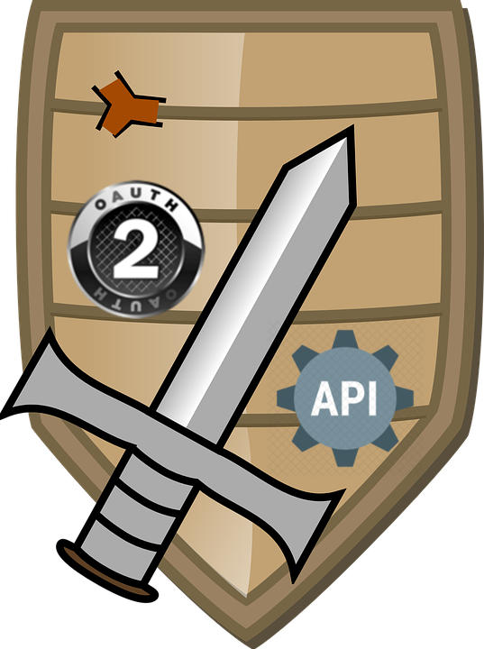

# Oauth2 Shield



# Endpoints

| Endpoint        | description  |
| ------------- |:-----|
| /oauth2/credentials      | client id & client secret generator
| /oauth2/token      | access_token generation
| /oauth2/introspect      | return meta information surrounding the token

# Prerequisites

- Linux
- Nodejs >= 8
- Mysql >= 5.7

# Required variables


| Variable        | description  |
| ------------- |:-----|
| token_secret      | alphanumeric string required to jwt token generation
| token_life      | string representation of token expiration time. Example: 10s, 50m, 1h,etc
| database_host      | mysql database host. Ip or domain
| database_user      | user to login into mysql database host.
| database_password      | password related to **database_user**.
| database_port      | mysql port. Most of the time is 3306
| database_name      | name of database.
| auth_realm      | alphanumeric string required to basic auth entropy.
| auth_user      | user to perform requests to **/oauth2/credentials** endpoint .
| auth_password      | password related to **auth_user**
| TZ      | Linux timezone. **IMPORTANT FOR DATES AND EXPIRATION TIME**. Example: 'America/Lima'

# Development

Just
```
npm install
```

Export required [variables](https://github.com/jrichardsz/oauth2-shield/wiki/Required-Variables)

And
```
npm run dev
```


# Production

Just
```
npm install
```

Export required [variables](https://github.com/jrichardsz/oauth2-shield/wiki/Required-Variables)

And
```
npm run start
```

# TO-DO

- Unit Tests
- Add UI for management events

# Contributors

<table>
  <tbody>
    <td>
      
      <br />
      <label><a href="http://jrichardsz.github.io/">Richard Leon</a></label>
      <br />
    </td>    
  </tbody>
</table>
